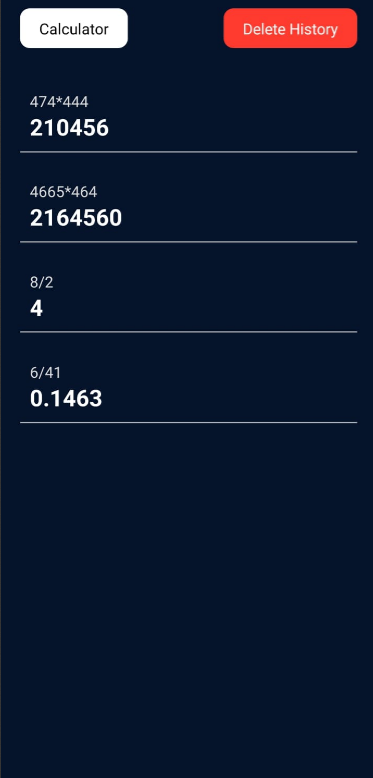

# React Native Calculator App

A sleek and modern calculator app built using React Native. The app allows users to perform basic arithmetic operations and stores calculation history in MongoDB for future reference. Users can switch between the calculator and history views with ease.

## Screenshots

### Calculator View


### History View


## Features
- Basic arithmetic operations (addition, subtraction, multiplication, division).
- Calculation history stored in MongoDB.
- Ability to view and delete history.

## Tech Stack
- **Frontend:** React Native
- **Backend:** Express.js, Node.js
- **Database:** MongoDB

## Installation

1. Clone the repository:
   ```bash
   git clone https://github.com/Mathavaroopan/calculator-app.git
   cd calculator-app
   ```

2. Run the Express.js backend server:
   ```bash
   cd server
   npm install
   npm start
   ```

3. Install the required dependencies for React Native:
   ```bash
   cd CALCULATOR
   npm install
   npm run android
   ```

## Usage

1. Open the app to access the calculator.
2. Tap on the "History" button to switch to the history view.
3. To delete the history, tap on the "Delete History" button.

Calculate and Enjoy!!!
